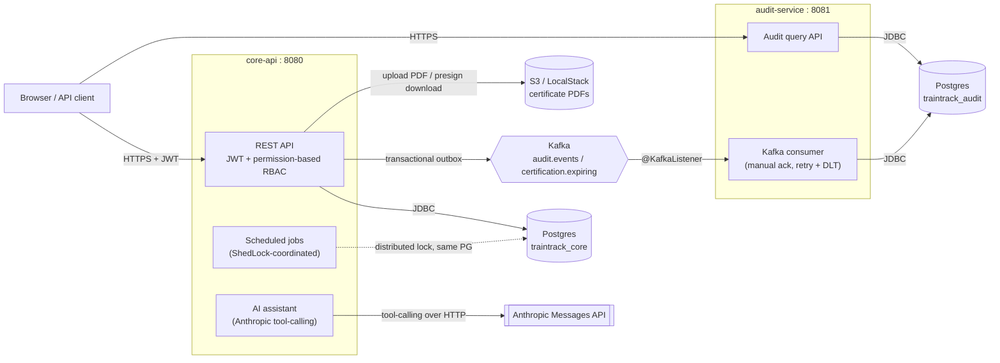

# TrainTrack

[](https://github.com/OmkarBV/traintrack/actions/workflows/ci.yml)

Training and certification management platform for organisations running compliance training: course catalog, enrolments, certificate issuance with real PDF documents, an audit trail that survives its consumer being down, scheduled compliance jobs coordinated across multiple instances, and an AI assistant that respects the same permission model as the REST API. Backend only, built in ten phases (below), each one committed and pushed separately with its own reasoning intact rather than squashed into one final state.

## Contents

- [Architecture](#architecture)
- [Getting started](#getting-started)
- [Design decisions, phase by phase](#design-decisions-phase-by-phase) — the "why," not just the "what," for every non-obvious call made along the way
- [What I'd do differently at 100x scale](#what-id-do-differently-at-100x-scale)

## Architecture

Two Spring Boot services, one shared Postgres instance (two separate databases — see below), Kafka as the seam between them, S3 for certificate documents, and Anthropic's API for the assistant. Nothing here is a microservices reference architecture for its own sake: `audit-service` is genuinely separate because an audit trail should survive the thing it's auditing having a bad day, not because "more services" is a goal.



**Why one Postgres instance but two databases, not two instances.** `audit-service` needing to survive independently of `core-api` is about process and deployment independence — it must keep consuming Kafka and stay queryable even if `core-api` (or its database load) is having problems. A shared Postgres *instance* with a separate *database* per service gets that: no shared schema, no cross-service foreign keys, no way for one service's migrations to touch the other's tables, but without the operational cost of a second database server for a project at this scale (see [docker/postgres/init-db.sh](docker/postgres/init-db.sh)). A real production deployment with a large audit volume would likely split these onto separate instances, or even a separate storage engine better suited to append-mostly, rarely-updated data — that trade-off is called out again below.

**Why Kafka, specifically, as the seam** rather than a direct HTTP call from `core-api` to `audit-service`: see the "Audit pipeline" section further down for the full reasoning — the short version is that a direct call would make certification issuance fail whenever the audit service happened to be down, which is backwards for a system whose whole point is a reliable compliance record.

## Getting started

Prerequisites: JDK 21 and Docker. Maven itself isn't required — every command below uses the bundled wrapper (`./mvnw`).

```bash
cp .env.example .env            # defaults work for local dev as-is
docker compose up -d            # Postgres, Kafka (KRaft, no Zookeeper), LocalStack (S3)

./mvnw -pl traintrack-core-api -am spring-boot:run       # :8080 — runs Flyway migrations on startup
./mvnw -pl traintrack-audit-service -am spring-boot:run  # :8081 — separate schema, separate consumer group
```

Every seeded user's password is `password123`. Two organisations are seeded specifically so tenant isolation is testable out of the box, not just asserted:

| Email | Organisation | Role | Can see |
|---|---|---|---|
| `admin@acme.test` | Acme Compliance Ltd | ADMIN | everything, within Acme |
| `trainer@acme.test` | Acme Compliance Ltd | TRAINER | courses, enrolments, certificates — org-wide |
| `employee@acme.test` | Acme Compliance Ltd | EMPLOYEE | read-only, own data only |
| `admin@beta.test` | Beta Industries | ADMIN | everything, within Beta — nothing of Acme's |

```bash
./mvnw test    # full suite, including Testcontainers-based tests — needs a Docker daemon; see CI, below, if yours won't cooperate
```

API docs (Swagger UI) are at `/swagger-ui.html` on each service once running.

## Design decisions, phase by phase

The sections below are what actually happened, in build order, including the real bugs found along the way — not a cleaned-up retelling. Each one names a concrete trade-off rather than asserting a best practice; skip to whichever's relevant:

| Decision | Why it's not the obvious default |
|---|---|
| [Audit pipeline](#audit-pipeline-what-happens-if-audit-service-is-down-for-two-hours) | Transactional outbox + Kafka, so certification issuance never depends on `audit-service`'s uptime |
| [Bulk enrolment](#bulk-enrolment-concurrency-design-and-measured-benchmark) | A bounded worker pool sized to the DB connection pool, not CPU count — and a real cross-tenant leak this caught |
| [Scheduled jobs](#scheduled-jobs-why-shedlock-matters-and-what-idempotent-actually-means-here) | ShedLock across instances, and two genuinely different meanings of "idempotent" for two jobs that look similar |
| [S3 document storage](#s3-document-storage-one-code-path-for-localstack-and-real-aws-and-why-the-upload-isnt-async) | One S3 client for LocalStack and real AWS, and a deliberate choice to keep certificate upload synchronous |
| [AI assistant](#ai-assistant-real-rbac-enforcement-a-real-distributed-rate-limit-and-a-real-bug-caught-by-testing-both-live) | Tool-level RBAC against real permissions, a Postgres-backed distributed rate limit, and a real bug in upstream-error handling |
| [Testing](#phase-9-filling-in-the-testing-pyramid--web-layer-slices-and-what-testcontainers-cant-prove-in-this-sandbox) | Where unit tests, `@WebMvcTest` slices, and Testcontainers each earn their place |
| [CI](#phase-10-ci-and-what-the-first-real-run-of-these-tests-actually-found) | Two real bugs the first-ever real run of this test suite caught — and one real, still-open finding it surfaced |

## Audit pipeline: what happens if audit-service is down for two hours

Nothing is lost, and no manual intervention is needed, as long as the outage is shorter than the Kafka topic's retention window.

- **core-api keeps working the entire time.** Every state-changing operation writes its audit event to the `outbox_events` table in the *same database transaction* as the business change (the transactional outbox pattern — see `AuditPublisher`/`OutboxRelay`). That write succeeds or fails with the business change itself; it has nothing to do with whether audit-service, or even Kafka, is reachable at that moment.
- **Kafka keeps accepting events the entire time**, independent of audit-service's health — the broker and the consumer are separate processes. `OutboxRelay`'s `AFTER_COMMIT` listener and its 5-second sweep both keep publishing outbox rows to the `audit.events` topic exactly as normal; they have no dependency on audit-service being up. Events simply accumulate on the topic, retained under the broker's normal retention policy (`log.retention.hours`, 7 days by default — configured in `docker-compose.yml`'s Kafka service if you need to change it).
- **audit-service resumes from exactly where it left off.** Its consumer group (`audit-service`) commits offsets to Kafka only after a message is durably written (or dead-lettered) — never before, since acknowledgement is manual (`spring.kafka.listener.ack-mode: manual`, see `KafkaConsumerConfig`). While the service is down, its offset simply doesn't advance. On restart, it rejoins the consumer group and Kafka resumes delivery from the last committed offset — it processes everything that piled up during the outage, in the same per-partition order it was produced (partitioned by `orgId`), catching up in full.
- **The only real risk is retention.** If audit-service were down for *longer* than the topic's retention window, the oldest un-consumed messages would be deleted before it ever saw them — a genuine, permanent gap in the audit log. Two hours against a 7-day default retention is nowhere close to that boundary; a production deployment should set retention with a comfortable margin over the worst realistic outage.
- **Duplicates on recovery are expected and harmless.** A consumer restart can redeliver a message whose offset was fetched but not yet committed before the crash — normal at-least-once semantics. `audit_events.event_id` is the primary key (see `V1__audit_events.sql`), and `AuditEventRecord` deliberately forces an INSERT-only write path (`Persistable.isNew() == true`, always) rather than the upsert-on-duplicate behaviour Spring Data JPA defaults to for entities with a manually-assigned id — so a redelivered event hits a real unique-constraint violation, caught and logged as a no-op, rather than silently overwriting an existing row.

This was verified live, not just reasoned through: courses/enrolments were created while both services were running, a genuinely malformed message was published directly to the topic to confirm the retry-then-DLT path (`audit.events.DLT`) actually fires after 3 failed attempts, and a duplicate delivery was manually replayed to confirm it hits the unique-constraint path rather than silently overwriting the stored row.

## Bulk enrolment: concurrency design and measured benchmark

`POST /api/v1/enrolments/bulk` accepts a CSV (`userId,courseId`, up to 5,000 rows), returns `202 Accepted` with a job id immediately, and processes rows in the background across a bounded worker pool. `GET /api/v1/jobs/{id}` reports status plus a per-row result (which rows succeeded, which failed and why) — partial failure never fails the whole batch.

**A correctness trap worth naming.** Row processing runs on background threads from a thread pool, not the original HTTP request thread. Spring Security's `SecurityContextHolder` is `ThreadLocal`-based and does *not* propagate to worker threads by default — and `TenantAwareJpaTransactionManager` (Phase 2) reads the org id from that same security context to decide whether to enable the org-scoping Hibernate filter. Left unaddressed, every bulk-processed row would run with the tenant filter silently *off*, meaning a CSV referencing another organisation's `userId` would succeed instead of correctly failing — a real cross-tenant data leak, not a hypothetical one. Both executors (`bulkEnrolmentExecutor` and the coordinator's virtual-thread executor, see `BulkEnrolmentExecutorConfig`) are wrapped in Spring Security's `DelegatingSecurityContextExecutor` specifically to close this gap. Verified live, not just reasoned through: a bulk CSV containing another organisation's user id was submitted and correctly came back `FAILED — User not found`, exactly as a same-org caller manually requesting that user by id already does (Phase 2).

**Thread pool sizing.** The worker pool (`bulkEnrolmentExecutor`) is sized relative to the JDBC connection pool, not CPU count — this is I/O-bound work (DB round-trips), and more worker threads than available DB connections would just queue on the connection pool rather than add throughput. `corePoolSize=4, maxPoolSize=8`, against a Hikari `maximum-pool-size` of 15 (bumped from Spring Boot's default 10, explicitly, in `application.yml`) — leaving 7 connections free for ordinary request traffic while a bulk job runs. `queueCapacity=5000` matches the endpoint's own row cap, so a single batch never triggers the rejection policy; `CallerRunsPolicy` remains configured as backpressure for the case where multiple organisations run bulk jobs concurrently and the combined queue does fill up. A second, separate executor — virtual threads, not a second bounded platform-thread pool — handles the coordinator role of fanning work out and waiting for it to finish: that role is cheap to block on and would otherwise waste a platform thread sitting idle for the duration of a large job.

**Transaction boundaries.** Each row commits independently: attempting the enrolment and recording its outcome (success or failure) are two separate `@Transactional` methods, not one — a Postgres transaction that hits an error can't run further statements until rolled back, so trying to record a row's *failure* inside the same transaction that just failed to create it would itself fail. See `BulkEnrolmentRowProcessor`.

**Measured benchmark** (this sandbox, not representative of production hardware — the point is the methodology and the real, not invented, numbers): 500 enrolments, same dataset, same seeded users/course, via `POST /api/v1/enrolments` called once per row in a loop (sequential) versus the same 500 rows submitted as one CSV to `POST /api/v1/enrolments/bulk` (parallel, timed from submission to the job reporting `COMPLETED`).

| Run | Sequential | Parallel | Speedup |
|---|---|---|---|
| 1 | 15.79s (31.7 rows/sec) | 2.45s (203.9 rows/sec) | 6.44x |
| 2 | 13.05s (38.3 rows/sec) | 2.39s (208.9 rows/sec) | 5.45x |

A ~6x speedup against an 8-thread pool is consistent with real overhead (connection acquisition, thread handoff, the coordinator itself) eating into the theoretical 8x ceiling for embarrassingly-parallel I/O-bound work — not a number that was picked to look good.

## Scheduled jobs: why ShedLock matters, and what "idempotent" actually means here

Two daily jobs (`CertificationExpiryScheduler`): mark lapsed certifications `EXPIRED`, and publish `certification.expiring` events for certifications entering a 30-day expiry window.

**Why ShedLock, concretely, not just "best practice".** In a horizontally-scaled deployment, every app instance runs its own independent in-process Spring scheduler. Without coordination, *all* instances fire the same cron trigger at the same wall-clock time — not a hypothetical race, exactly what happens by default. For "mark lapsed as EXPIRED" that's wasteful but harmless: every instance's query targets the same rows, whichever commits first wins, the rest no-op. For "publish expiring events" it's a genuine bug: N instances would each independently query the same not-yet-notified certifications *before any of them commits* the notified-flag, and each would publish its own duplicate event — a race the query's own idempotency check can't catch, because that check only prevents re-notifying *tomorrow*, not concurrently *today*. ShedLock's DB-row lock (`shedlock` table, `JdbcTemplateLockProvider`, see `ShedLockConfig`) means only one instance ever runs a given job at a time, so the race never starts in the first place.

**"Idempotent and safely re-runnable" means two different things for these two jobs, and both are handled at the query level, not by catching exceptions after the fact:**
- The expiry job's idempotency is incidental: its query (`status = ACTIVE and expiresAt < now`) only ever matches certifications it hasn't already transitioned, so re-running it — deliberately, or because it happens to fire again tomorrow — simply finds nothing left to do for anything already EXPIRED.
- The notification job's idempotency had to be designed in deliberately. The literal reading of "find certifications expiring within 30 days and publish an event" would re-publish for the *same* certification every single day it remains in that 30-day window, once per day, for up to 30 days — not obviously wrong, but not obviously idempotent either, and not what "idempotent and safely re-runnable" should mean. `Certification.expiringNotifiedAt` is set the moment a certification is published, in the same transaction as the outbox write, and the query only ever selects rows where it's still null. A certification is notified about exactly once — the first time it enters the window — not once per day for the remainder of it.

Both verified live against a real cron trigger (temporarily set to every 10 seconds for the test, not the real daily schedule): a manually-inserted lapsed certification transitioned to `EXPIRED` and produced a `CERTIFICATION_EXPIRED` audit event; a manually-inserted certification 10 days from expiry produced exactly one `certification.expiring` event on the Kafka topic, and a second cron cycle immediately afterward logged `Published 0` / `Marked 0` — confirming both jobs are genuine no-ops the second time, not just "didn't crash".

**A build-tooling bug found along the way, not a scheduling one.** `mvn package` was silently producing a plain, non-executable jar this entire project — `spring-boot-maven-plugin`'s `repackage` goal is bound to the `package` phase automatically by `spring-boot-starter-parent`, and since this project intentionally doesn't inherit from it (see Phase 1), that binding was never declared. Every phase up to this one only ever ran via `spring-boot:run`, which doesn't depend on that binding, so the gap was invisible until building a real jar to test the scheduled jobs against (`spring-boot:run`'s live-recompile turned out to be vulnerable to a separate, unrelated problem: the IDE's own background Java compiler writing stale/corrupted class files into the same `target/classes` Maven was using, mid-test). Fixed by adding an explicit `<execution><goals><goal>repackage</goal></goals></execution>` to both services' POMs.

## S3 document storage: one code path for LocalStack and real AWS, and why the upload isn't async

On `PATCH /api/v1/enrolments/{id}/complete`, alongside the `Certification` row itself, core-api now renders a one-page PDF certificate (`CertificatePdfGenerator`, built directly with PDFBox's content-stream API — no template engine, since the layout is fixed) and uploads it to S3, storing the object key on `certifications.certificate_url`. Downloads never hand out that key directly: `GET /api/v1/certifications/{id}/download-url` mints a short-lived presigned URL on request (`CertificateStorageService`, default 15-minute TTL) — the bucket itself has no public access at all, so a leaked key alone is useless.

**Same client, two targets, no branching in application code.** `S3Config` builds one `S3Client`/`S3Presigner` pair from `traintrack.s3.*` properties. When `traintrack.s3.endpoint` is set (LocalStack, `http://localhost:4566` by default — see docker-compose.yml), the client is pointed at it and path-style bucket addressing is forced on, since LocalStack doesn't support virtual-hosted-style URLs. Leave `AWS_S3_ENDPOINT` unset in a real deployment and the same builder falls through to the SDK's normal AWS regional endpoints with the SDK's normal (virtual-hosted) addressing — `CertificateStorageService` calls `putObject`/presigns exactly the same way either way; it has no idea which target it's talking to.

**LocalStack needs its bucket created; real AWS wouldn't.** A fresh LocalStack container starts with zero buckets — unlike a real AWS account, where the bucket already exists because it was provisioned once via Terraform/CDK/console and just sits there across restarts. Without creating it, every upload would fail with `NoSuchBucket` on a clean `docker compose up`. `docker/localstack/init-s3.sh` runs `awslocal s3 mb` on container start (LocalStack's `/etc/localstack/init/ready.d/` hook mechanism) so the bucket is there before core-api ever tries to use it — a dev-environment convenience with no real-AWS equivalent needed, and no effect on real AWS if this code ever ran against it.

**Why the upload sits inside the same `@Transactional` method as the certification insert, not decoupled the way the audit outbox is.** A `Certification` row whose PDF failed to render or upload is a broken record, not a valid "certificate pending" state — nothing in this system ever retries a failed certificate generation, so if the whole `complete()` call rolls back when S3 is briefly unreachable, that's correct: the caller sees a failure and can retry the same idempotent-ish action, rather than the API reporting success for a certificate nobody can ever download. The trade-off is real and deliberate: this holds a database connection open for the duration of an S3 network call, which doesn't scale past a certain throughput. At meaningfully higher volume this would move to the same transactional-outbox shape Phase 4 already uses for Kafka — commit the certification row immediately, generate/upload asynchronously off an outbox event, and let a background sweep retry a failed upload instead of failing the whole request.

**Ownership enforcement for downloads had to move out of `@PreAuthorize`.** The existing `byUser` endpoint's SpEL check (`#id == authentication.principal.userId()`) works because the path variable *is* the user id being checked. Downloading is addressed by certification id, and there's no way to compare that to the caller's identity without first loading the row — so `CertificationController.downloadUrl` only gates coarsely (caller has *some* certificate-viewing permission at all), and `CertificationService.generateDownloadUrl` does the real check against the certification actually fetched: callers with `CERT_VIEW_ALL` can download any certificate in their org (tenant-scoped, as always); callers with only `CERT_VIEW_OWN` get an `AccessDeniedException` — the same 403 path Spring Security's own `@PreAuthorize` failures use — the instant the certificate's owner doesn't match.

Verified live end-to-end, not just unit-tested: completed a real enrolment and confirmed the resulting PDF actually landed in the LocalStack bucket (`awslocal s3 ls`), downloaded it through a real presigned URL and extracted its text to confirm the rendered name, course title, and dates were correct (not just "a PDF got made"), then exercised all three access outcomes against the running app — the certificate's own owner downloading successfully, a different user's `CERT_VIEW_OWN`-only caller getting a 403, and a pre-Phase-7 certification with no stored key correctly returning 404 rather than a broken URL.

## AI assistant: real RBAC enforcement, a real distributed rate limit, and a real bug caught by testing both live

`POST /api/v1/assistant/messages` lets any authenticated user ask natural-language questions about courses, enrolments, and certifications. Behind it, `AssistantService` runs Anthropic's tool-use loop directly over HTTP (no SDK — see the class-level Javadoc on `AnthropicClient` for why a hand-rolled client made more sense than pulling in a whole SDK for one endpoint): it sends the conversation plus three tool definitions, and if the model asks to use one, executes it server-side and feeds the result back, repeating until the model produces a final answer instead of another tool request.

**RBAC enforcement happens inside each tool, against the caller's real permissions — not a parallel, simplified copy of the rule.** `list_my_certifications` calls the same `CertificationService.findByUser` the `GET /api/v1/users/{id}/certifications` endpoint uses; `search_certifications` calls the same `CertificationService.search` behind `GET /api/v1/certifications`, gated on `CERT_VIEW_ALL` exactly like that endpoint's `@PreAuthorize`; `search_courses` calls `CourseService.list` gated on `COURSE_VIEW`. Asking the assistant "what's expiring org-wide?" without `CERT_VIEW_ALL` doesn't error out the whole request — the tool throws `AccessDeniedException`, which `AssistantService` turns into a `tool_result` the model reads and explains in plain language, the same way a person would tell you "you don't have permission for that" instead of the request just failing.

**The rate limit is enforced in Postgres, not in application memory, and checked before the first Anthropic call, not after.** core-api runs as multiple instances (see Phase 6's ShedLock table for the same underlying concern), so an in-process counter would let each instance hand out its own independent quota — a caller alternating between two instances would silently get double the configured limit. `AssistantRateLimiter` uses a single atomic `INSERT ... ON CONFLICT ... DO UPDATE ... RETURNING` against a fixed-window counter table (`assistant_rate_limits`), which is what makes concurrent requests for the same user, landing on different instances, count correctly instead of racing on a read-then-write. It runs first in `AssistantService.chat()`, specifically so a request over quota never spends a billed Anthropic call before being rejected. (A fixed window trades away some precision for simplicity: a caller can get up to roughly 2x the configured rate across a single window boundary — accepted here as a well-understood trade-off, not an oversight.)

**A real bug, caught by testing the failure path live, not just the happy path.** With no real Anthropic key available in this environment, live-testing this phase meant deliberately pointing it at Anthropic with an invalid key — which surfaced a genuine bug: `RestClient` throws `HttpClientErrorException.Unauthorized` on a 401 response, and left uncaught, that exception's own status code (401) became *this API's* response code, indistinguishable from core-api's own authentication failing. A caller would have no way to tell "your session expired" apart from "the AI provider rejected our API key" — actively misleading, not just an ugly error. Fixed by having `AnthropicClient` catch every `RestClientException` and translate it into a single `AssistantUnavailableException` (502), regardless of whether the underlying cause was a bad key, a 5xx from Anthropic, or a network timeout — a caller now correctly sees "the assistant is temporarily unavailable" instead of a confusing, wrong 401.

Verified live: hit the endpoint repeatedly against a temporarily-lowered limit (3 requests/hour) with an intentionally invalid API key — the first 3 requests correctly passed the rate limiter and failed cleanly with 502 (proving the Anthropic call path and its error handling both work), and the 4th was correctly rejected with 429 *before* attempting to call Anthropic at all (confirmed via the request counter in `assistant_rate_limits`, and by the fact that no 4th outbound call was attempted). The tool-use loop itself — a model requesting a tool, the tool executing and returning data, a permission denial becoming a graceful `tool_result` instead of a failure — is covered by `AssistantServiceTest` against a mocked `AnthropicClient`, since a full live round trip needs a real `ANTHROPIC_API_KEY`, which isn't provisioned in this environment.

## Phase 9: filling in the testing pyramid — web-layer slices, and what Testcontainers can't prove in this sandbox

Up to this point almost every test was a Mockito-based unit test of one service class, plus a single Testcontainers-based full-stack test (`AuthOrgIsolationIntegrationTest`, Phase 2). That leaves a real gap: nothing exercised the web layer itself — routing, `@PreAuthorize` SpEL, request validation, or whether a thrown exception actually maps to the HTTP status it's supposed to — independent of whether the business logic underneath happens to be right. Phase 9 adds the two testing styles the brief actually asked for and this project didn't have yet.

**`@WebMvcTest` slices** (`CourseControllerTest`, `CertificationControllerTest`, `AssistantControllerTest`, 19 tests) load only the web layer, with the service mocked out — proving the controller's own contract, not the business logic behind it. Each earns its place by covering a genuinely different authorization shape: `CourseController` is a plain single-permission gate per action; `CertificationController`'s `download-url` endpoint (Phase 7) splits its check across two layers — a coarse `@PreAuthorize` OR-gate in the controller and a fine-grained per-certificate ownership check inside the (mocked) service — and these tests confirm an `AccessDeniedException` thrown from that second layer still translates to a 403 the same way a `@PreAuthorize` failure would, which nothing had verified before; `AssistantController` pins the exact case manually curl-tested during Phase 8 (an unhandled upstream failure must not leak through as a misleading 401) as an actual regression test instead of a one-off manual check.

A real, if minor, gotcha surfaced immediately: these slices don't load the app's own `SecurityConfig` (which explicitly disables CSRF for this stateless JWT API) — only Spring Boot's default security auto-configuration, which has CSRF *on*. Every `POST` failed with 403 before `@PreAuthorize` even ran, for a reason that had nothing to do with permissions. Fixed with Spring Security Test's standard `.with(csrf())` request post-processor — the normal, expected shape of this kind of slice test, not a workaround.

**Testcontainers additions** (`CourseEnrolmentLifecycleIntegrationTest`, `AssistantRateLimiterIntegrationTest`) extend the existing real-Postgres integration-test base to two things nothing covered yet: that Phase 2's tenant-isolation guarantee generalises correctly to Phase 3's entities (a course created by one org is invisible to another; enrolling a user from a different org 404s, not 403 or 200 — the same distinction `AuthOrgIsolationIntegrationTest` established for Users), and — the more interesting one — that `AssistantRateLimiter`'s atomic-increment claim actually holds under real concurrency: 30 threads incrementing the same user's counter simultaneously against a real Postgres, asserting the final count is exactly 30. A mocked-`JdbcTemplate` unit test can assert that the SQL *looks* atomic; only a real database under real concurrent load can prove the `INSERT ... ON CONFLICT ... DO UPDATE ... RETURNING` doesn't lose an update to a race — which is the entire reason that method isn't a separate `SELECT` followed by an `UPDATE`.

**What was actually verified here versus reasoned through, at the time this phase was written.** This sandbox's Docker daemon enforces a minimum API version newer than what testcontainers-java 1.21.4's container-detection probe speaks — a pre-existing, already-documented constraint from before this phase (see `AbstractIntegrationTest`'s Javadoc), not something introduced now. All three Testcontainers-based test classes, old and new, failed identically here with "Could not find a valid Docker environment." Both new integration tests were reviewed carefully against the real DTOs, permission seed data, and idempotency behavior they exercise, but at the time, unlike every other live claim in this README, they had only compiled cleanly, not run to green. **Phase 10 closes that gap for real** — see the CI section below, including two genuine bugs the first actual run of these tests caught that no amount of code review here would have found.

## Phase 10: CI, and what the first real run of these tests actually found

Adding `.github/workflows/ci.yml` (`./mvnw test` on every push/PR) wasn't just a checkbox — it was the first time any Testcontainers-based test in this project ran anywhere with a Docker daemon that actually cooperates, since this sandbox's never has. That first real run immediately found two genuine bugs neither local testing nor code review had caught, and pushing the fixes in the open, with `gh run watch` pointed at the live GitHub Actions run each time, made this the one part of the project where "verified live" means something even stronger than usual: verified on infrastructure this session never had access to.

**Run 1 (91 tests, 5 errors, 11m49s):** every failure was in `AuthOrgIsolationIntegrationTest` — a test that had never actually executed against real infrastructure before, in this project's entire history. Root cause: each `AbstractIntegrationTest` subclass gets its own Postgres Testcontainer, started fresh and torn down by JUnit's `@Testcontainers` extension at the end of that class — but Spring's test-context cache keeps the `ApplicationContext` (and everything running through `@EnableScheduling`: `OutboxRelay`'s 5-second sweep, ShedLock's cron evaluation) alive across test classes for performance, with nothing telling it to do otherwise. Once one class's container was stopped, its context's scheduled tasks kept retrying against the now-dead container every 5 seconds for the rest of the entire run — each failure burning CPU on the runner's 2 cores, apparently enough of it that a *later*, unrelated test class's perfectly healthy Postgres connections started timing out too. Fixed with `@DirtiesContext(classMode = AFTER_CLASS)` on `AbstractIntegrationTest`, so Spring closes the context — and stops its scheduler — at the exact point its container also goes away.

**Run 2 (91 tests, 2 errors, 9m44s):** a clean improvement (`AuthOrgIsolationIntegrationTest` down from 151.7s and 5 errors to 44s and 2), and the 2 remaining failures were both `HttpRetryException: cannot retry due to server authentication, in streaming mode` — a long-standing JDK bug where `HttpURLConnection` (which `TestRestTemplate` falls back to when nothing else is on the classpath) has special, broken internal handling specifically for 401 responses to a request with a body, and throws instead of returning a normal `ResponseEntity`. Exactly the two tests expecting a 401 from a POST (`loginWithWrongPasswordReturns401`, `refreshTokenIsSingleUse`) were affected; every other status code had worked the entire time. Fixed by adding `httpclient5` as a test dependency — Spring Boot auto-prefers Apache HttpClient over the JDK default the moment it's on the classpath, no code changes needed.

**Run 3: green.** All 94 tests (91 in core-api, 3 in audit-service), including every Testcontainers-based class this whole README has been honest about never having run.

**One real, reproducible, and still-open finding from that green run, worth naming rather than hiding:** `CourseEnrolmentLifecycleIntegrationTest` — 4 straightforward HTTP tests — consistently takes over seven minutes (434.7s, identically across runs 2 and 3), while every other test class finishes in seconds. The cause traces back to `OutboxRelay.publishIfUnpublished`, which calls `kafkaTemplate.send(...).get(5, TimeUnit.SECONDS)` — a genuinely blocking wait, both on the request thread via the `AFTER_COMMIT` listener and, more damagingly, inside the 5-second sweep's plain sequential `forEach`. With no Kafka broker reachable in CI, every row this test class's course-creation and enrolment calls write to the outbox stays permanently unpublished, so every sweep tick re-attempts the entire growing backlog, each row blocking up to 5 seconds, forever, for as long as that test class's context is alive. This is a real design gap, not just a CI artifact: the "Audit pipeline" section above states that core-api "keeps working the entire time" during a Kafka outage, and functionally that's still true — but it understates the cost, since every audit-emitting request pays up to 5 seconds of added latency during such an outage, and the sweep's cost grows without bound as the backlog does, with no backoff. The fix — making the send genuinely non-blocking (react to the returned `CompletableFuture` instead of calling `.get()` on it) rather than "blocking with a short timeout" — is real and understood, but is a change to already-shipped, README-documented Phase 4 code, not a Phase 10 polish task, so it's named here rather than made unprompted.

## What I'd do differently at 100x scale

Everything above was sized for a portfolio project's real but modest scale — one Postgres instance, a handful of app instances, traffic that fits comfortably on one machine's connection pool. None of it is wrong at that scale; some of it stops being right well before 100x. In roughly the order they'd start to hurt:

- **The rate limiter would move out of the primary OLTP database.** `assistant_rate_limits` does one atomic upsert per assistant request against the same Postgres instance serving every other read and write. That's fine at current volume and is exactly why it's a fixed-window Postgres counter rather than something fancier — but at 100x request volume, a handful of heavy users become hot rows, contending for the same lock on every request and competing with unrelated business traffic for the same connection pool. The fix is a purpose-built layer for this — Redis with a Lua-scripted token bucket, or a dedicated rate-limiting service — that isolates "is this caller over quota" from "is the database that runs the business healthy."

- **Certificate generation and upload would move off the request path entirely.** Phase 7 made this synchronous deliberately: a certification without a retrievable certificate is a broken record, so a transient S3 outage should fail the whole `complete()` call rather than paper over it. That reasoning holds at any scale — what changes is the acceptable latency and connection-hold time of doing it inline. At 100x, this becomes the same transactional-outbox shape Phase 4 already uses for Kafka: commit the certification row immediately, enqueue a "generate and upload" outbox event in the same transaction, and let a background worker pool (with retry) handle the PDF and S3 call — the API response no longer waits on either.

- **ShedLock's one global lock per job would become a bottleneck, not just a coordination mechanism.** It's the right tool for "exactly one instance runs this job" at any scale — the problem at 100x is that the *job itself* stops fitting on one instance. Sweeping certification expiry across a dataset 100x larger inside one lock's `lockAtMostFor` window doesn't work no matter which instance holds the lock. That points toward sharding the work (by an org-id hash range, say) with one lock per shard, so the *coordination* guarantee stays exactly as simple while the *work* parallelises across instances.

- **The Hibernate `@Filter`-based tenant scoping would get a second, independent layer underneath it.** `TenantAwareJpaTransactionManager` enabling an org-scoping filter on every transaction is a good single point of enforcement — structurally hard to forget on a new query, unlike a hand-written `WHERE org_id = ?` on every repository method. It's still exactly one mechanism, enforced in application code. At a scale where a cross-tenant leak is catastrophic rather than merely bad, I'd add Postgres row-level security policies on every tenant-owned table as a second, independent backstop — so a bug in the Java layer (a raw query that bypasses the filter, a new entity that forgets the annotation) still can't leak another org's data, because the database itself refuses the row.

- **Bulk enrolment's worker pool would stop being one instance's thread pool.** Phase 5 sized `bulkEnrolmentExecutor` against that one instance's own JDBC connection pool — correct for "how many rows can this instance process at once," but a ceiling on total system throughput that adding more instances doesn't raise on its own, since each new instance just adds its own separately-sized pool against the same shared database. At 100x scale, with genuinely large batches from many orgs concurrently, the natural evolution is to make `bulk_enrolment_job_rows` (already effectively a work queue, just polled by one instance) a real queue — consumed by a pool of workers that scales independently of any request-serving instance.

- **Observability would need to exist at all.** Every "verified live" claim in this README came from a manual curl session and reading application logs by eye — completely reasonable at this scale, and how most of the real bugs in this project were actually found. At 100x, that doesn't scale to a human: structured logging with correlation IDs that survive the outbox → Kafka → consumer hop, metrics on outbox lag and rate-limiter rejection rates and certificate-upload failure rates, and alerts on the failure modes this README already knows about (a stuck outbox sweep, a ShedLock job that's stopped running, a consumer group that's stopped advancing) — not because any of those failure modes are new at 100x, but because at 100x nobody's watching the logs when they happen.

- **The audit database would stop being "the other database on the same Postgres instance."** That shared-instance, separate-database split (see Architecture, above) buys process independence cheaply at this scale. Audit data is written far more than it's read and only ever grows, so at real volume I'd partition `audit_events` by time and move genuinely cold partitions to cheaper storage — while keeping the actual architectural decision this project already made (audit-service stays independently deployable and queryable) unchanged, because that reasoning doesn't get weaker at scale, only the storage underneath it needs to change.
